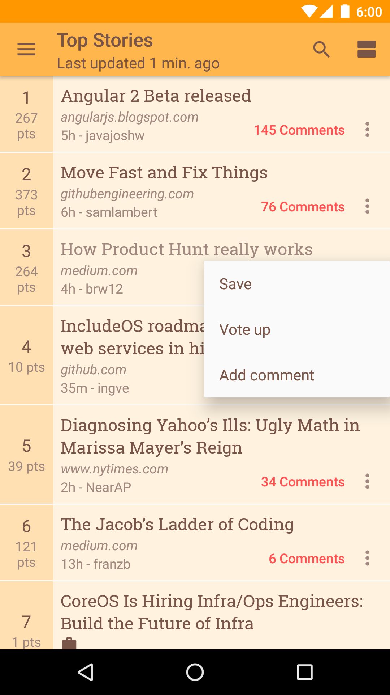
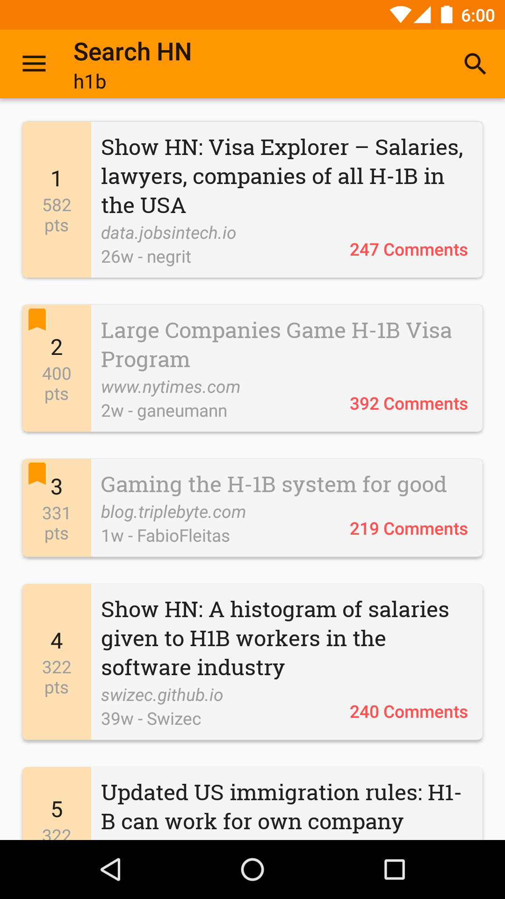

## Materialistic for Hacker News
Material design [Hacker News] client for Android, uses official [HackerNews/API], [Dagger] for dependency injection and [Robolectric] for unit testing.

[![Get it on Google Play][Play Store Badge]][Play Store]

### Setup
**Requirements**
- JDK 8
- Latest Android SDK tools
- Latest Android platform tools
- Android SDK 28
- AndroidX

**Dependencies**
- [Official Hacker News API][HackerNews/API], user services (e.g. login/create account/vote/comment) rely on redirect requests to Hacker News website
- [Algolia Hacker News Search API]
- [Mercury Web Parser API]
- [Android Jetpack]: appcompat-v7 / recyclerview-v7 / design / cardview-v7 / preference-v7 / customtabs
- Square [Retrofit] / [OkHttp] / [AssertJ] / [Dagger] / [LeakCanary]
- [RxJava] & [RxAndroid]
- [Robolectric]
- [PDF.js]

**Build**

    ./gradlew assembleDebug

Build with LeakCanary on

    ./gradlew assembleDebug -Pleak

Grab your Mercury Web Parser API key [here][mercury] if you want to connect to Mercury.

**Test** [![Build Status]][Travis]

Run all/selective tests:

    ./gradlew testDebug
    ./gradlew testDebug --tests "*HackerNewsClientTest"

**Coverage** [![Coverage Status]][Coveralls]

    ./gradlew jacocoTestReport

### Articles
- [Supporting multiple themes in your Android app (Part 1)][article-theme1]
- [Supporting multiple themes in your Android app (Part 2)][article-theme2] [![][Android Weekly 144 Badge]][Android Weekly 144]
- [Building custom preferences with preference-v7][article-preference]
- [Hacking up an ad blocker for Android][article-adblocker]
- [Bottom sheet everything][article-bottom-sheet] [![][AndroidDev Digest 99 Badge]][AndroidDev Digest 99] [![][Android Weekly 227 Badge]][Android Weekly 227]

### Screenshots

### Contributing
Contributions are always welcome. Please make sure you read [Contributing notes](CONTRIBUTING.md) first.

### License
    Copyright 2015 Ha Duy Trung
    
    Licensed under the Apache License, Version 2.0 (the "License");
    you may not use this file except in compliance with the License.
    You may obtain a copy of the License at
    
        http://www.apache.org/licenses/LICENSE-2.0
    
    Unless required by applicable law or agreed to in writing, software
    distributed under the License is distributed on an "AS IS" BASIS,
    WITHOUT WARRANTIES OR CONDITIONS OF ANY KIND, either express or implied.
    See the License for the specific language governing permissions and
    limitations under the License.

[Build Status]: https://travis-ci.org/hidroh/materialistic.svg?branch=master
[Travis]: https://travis-ci.org/hidroh/materialistic
[Coverage Status]: https://coveralls.io/repos/hidroh/materialistic/badge.svg?branch=master
[Coveralls]: https://coveralls.io/r/hidroh/materialistic?branch=master
[Hacker News]: https://news.ycombinator.com/
[HackerNews/API]: https://github.com/HackerNews/API
[Play Store]: https://play.google.com/store/apps/details?id=io.github.hidroh.materialistic&referrer=utm_source%3Dgithub
[Play Store Badge]: https://play.google.com/intl/en_us/badges/images/badge_new.png
[Algolia Hacker News Search API]: https://github.com/algolia/hn-search
[Mercury Web Parser API]: https://mercury.postlight.com/web-parser/
[AOSP support library]: https://developer.android.com/tools/support-library/features.html
[Retrofit]: https://github.com/square/retrofit
[OkHttp]: https://github.com/square/okhttp
[AssertJ]: https://github.com/square/assertj-android
[Dagger]: https://github.com/square/dagger
[LeakCanary]: https://github.com/square/leakcanary
[RxJava]: https://github.com/ReactiveX/RxJava
[RxAndroid]: https://github.com/ReactiveX/RxAndroid
[Robolectric]: https://github.com/robolectric/robolectric
[mercury]: https://mercury.postlight.com/web-parser/
[article-theme1]: http://www.hidroh.com/2015/02/16/support-multiple-themes-android-app/
[article-theme2]: http://www.hidroh.com/2015/02/25/support-multiple-themes-android-app-part-2/
[article-preference]: http://www.hidroh.com/2015/11/30/building-custom-preferences-v7/
[article-adblocker]: http://www.hidroh.com/2016/05/19/hacking-up-ad-blocker-android/
[article-bottom-sheet]: http://www.hidroh.com/2016/06/17/bottom-sheet-everything/
[Android Weekly 144 Badge]: https://img.shields.io/badge/android--weekly-144-blue.svg
[Android Weekly 227 Badge]: https://img.shields.io/badge/android--weekly-227-blue.svg
[Android Weekly 144]: http://androidweekly.net/issues/issue-144
[Android Weekly 227]: http://androidweekly.net/issues/issue-227
[AndroidDev Digest 99 Badge]: https://img.shields.io/badge/androiddev--digest-99-blue.svg
[AndroidDev Digest 99]: https://www.androiddevdigest.com/digest-99/
[PDF.js]: https://mozilla.github.io/pdf.js/
