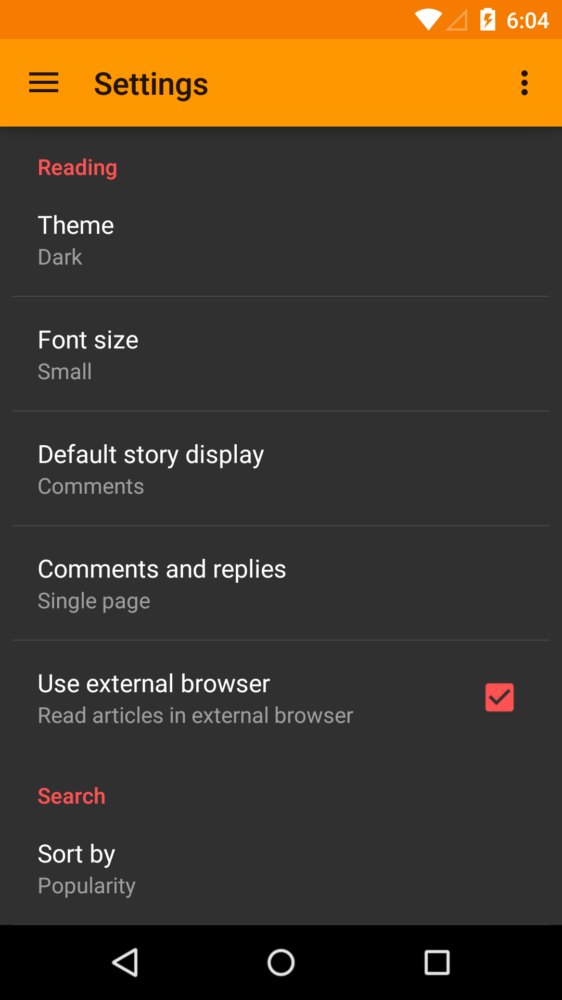
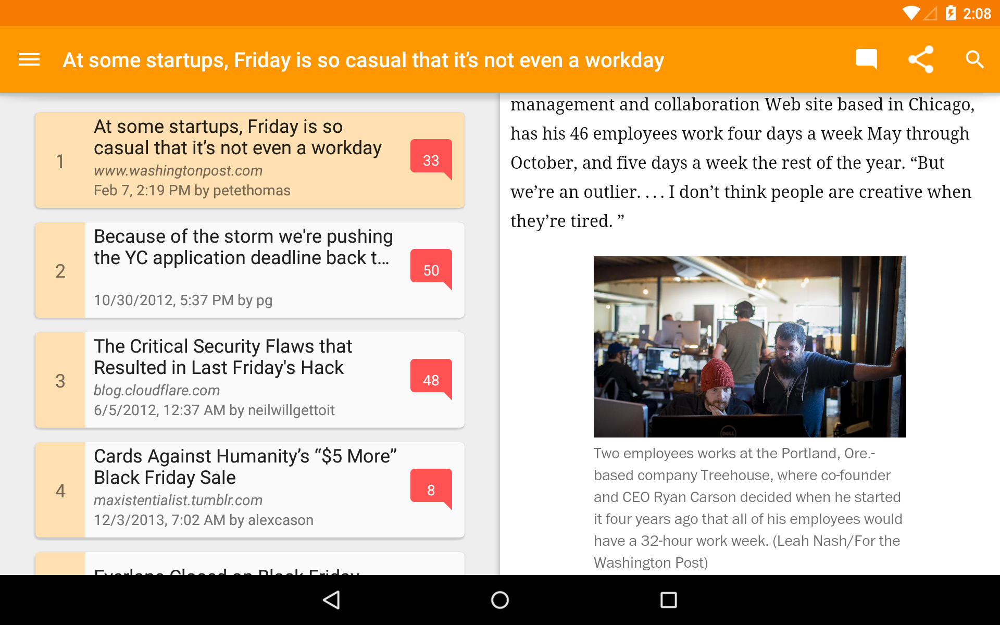
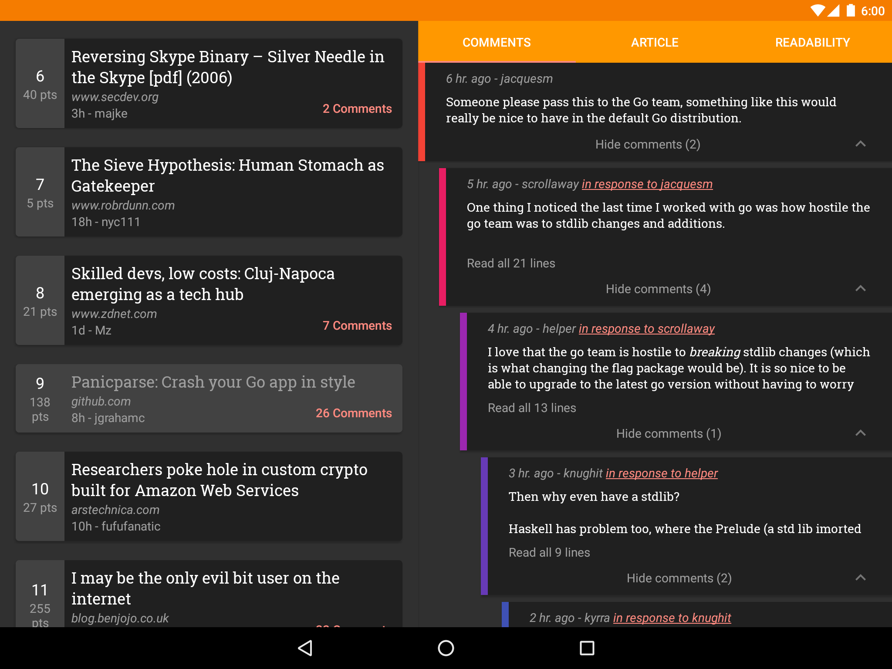

## Materialistic for Hacker News
Material design [Hacker News](https://news.ycombinator.com/) client for Android, uses official [HackerNews/API](https://github.com/HackerNews/API), [Dagger](http://square.github.io/dagger/) for dependency injection and [Robolectric](http://robolectric.org/) for unit testing.

### Setup
**Requirements**
- Latest Android SDK tools
- Latest Android platform tools
- Android SDK Build tools 23.0.2
- Android SDK 23
- Android Support Repository
- Android Support Library 23.1.1
- Google Repository
- Google Play services 8.3.0

**Dependencies**
- [Official Hacker News API](https://github.com/HackerNews/API)
- [Algolia Hacker News Search API](https://github.com/algolia/hn-search)
- [Readability Parser API](https://www.readability.com/developers/api/parser)
- AOSP [appcompat-v7](https://developer.android.com/tools/support-library/features.html#v7-appcompat) / [recyclerview-v7](https://developer.android.com/tools/support-library/features.html#v7-recyclerview) / [design](https://developer.android.com/tools/support-library/features.html#design) / [cardview-v7](https://developer.android.com/tools/support-library/features.html#v7-cardview) / [preference-v7](https://developer.android.com/tools/support-library/features.html#v7-preference) / [customtabs](https://developer.android.com/tools/support-library/features.html#custom-tabs)
- Square [Retrofit](https://github.com/square/retrofit) / [OkHttp](https://github.com/square/okhttp) / [AssertJ](https://github.com/square/assertj-android) / [Dagger](https://github.com/square/dagger)
- [Robolectric](https://github.com/robolectric/robolectric)

**Build**

    ./gradlew assembleDebug

Supply your own Readability API key & release signing config to build release. These have been left out on purpose.

**Test** 

Run all/selective tests:

    ./gradlew testDebug
    ./gradlew testDebug --tests "*HackerNewsClientTest"

You may need to set up Android Studio for unit test, by changing 'Build Variants -> Test Artifact' to 'Unit Tests'. See [technical docs](http://tools.android.com/tech-docs/unit-testing-support#TOC-Setting-up-Android-Studio).

**Coverage** 

    ./gradlew jacocoTestReport

### Articles
- [Supporting multiple themes in your Android app (Part 1)](http://www.hidroh.com/2015/02/16/support-multiple-themes-android-app/)
- [Supporting multiple themes in your Android app (Part 2)](http://www.hidroh.com/2015/02/25/support-multiple-themes-android-app-part-2/) 

### Screenshots

### License
    Copyright 2015 Ha Duy Trung
    
    Licensed under the Apache License, Version 2.0 (the "License");
    you may not use this file except in compliance with the License.
    You may obtain a copy of the License at
    
        http://www.apache.org/licenses/LICENSE-2.0
    
    Unless required by applicable law or agreed to in writing, software
    distributed under the License is distributed on an "AS IS" BASIS,
    WITHOUT WARRANTIES OR CONDITIONS OF ANY KIND, either express or implied.
    See the License for the specific language governing permissions and
    limitations under the License.
